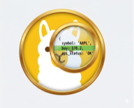

# Codetective

A local tool that answers *"who owns this code, who's actively touching it, and what's in flight against it?"*

Paste a path, PR number, or contributor name — get the team, top experts, recent commits, open PRs, related Jira tickets, and an LLM-authored code-context narrative. One screen, under three seconds, nothing leaves the machine.

Built for the on-call moment when you've been paged on code you've never seen.



---

## Modes

| Mode | Input | What you get |
|---|---|---|
| **Path** | `rest/api/binder/binder.go` | Team, contributors, timeline, open/merged PRs, Jira context, LLM narrative, code preview, similar files |
| **PR** | `9764`, `LPCD-1560`, or a GitHub PR URL | Recommended reviewers (DOK-scored across all changed files), cross-team/conflict/stale risk flags, per-reviewer verdicts, changed-files drill-in |
| **Contributors** | `/contributors` | Org-wide directory grouped by team, activity badges, lazy-loaded LLM engineer profiles |
| **Snippet finder** | Any pasted code | `git grep` → path + line range. Bottom-bar shortcut: `⇧⌘F` |

---

## Guardrails

These are **hard constraints**. Reject PRs that break them.

1. **LOCAL ONLY.** No cloud LLM, no cloud embeddings, no hosted APIs beyond the ones that already own your data (GitHub, Jira). The tool reads proprietary repo metadata — paths, author names, commit subjects, internal Jira IDs, file contents that go into LLM prompts — and **nothing leaves the machine except to your existing GitHub/Jira accounts**. No OpenAI. No Anthropic. No hosted Llama. If Ollama is down, the LLM features degrade to empty — they never fall back to a cloud model.

2. **Deterministic-first, LLM-last.** Every factual claim on the page comes from `git`, `gh`, `acli`, or CODEOWNERS. The LLM only writes prose to *explain* those facts — it never invents them. Unreachable Ollama = blank narrative card, not hallucinated filler.

3. **No chatbot.** Paste an input, get one full result screen. No conversation turns, no back-and-forth. The UI is a dashboard, not an assistant.

4. **One repo at a time (for now).** Configured via `GOBROKER_PATH`. Multi-repo isn't implemented yet — single-repo was enough to prove the model for the hackathon.

5. **No frontend framework.** Single-file `index.html` + vanilla JS + `fetch()`. No build step, no bundler, no lock-in. If you need to read the client code, it's right there.

6. **Degradation is a visible feature, not a silent failure.** When `gh` rate-limits, Ollama is offline, or a file is missing from the checkout, the UI shows *which* source degraded and keeps rendering the rest. Never a blank screen.

7. **Small modules.** Every `server/*.py` module stays under ~200 lines and owns one clear concern. If a module is growing, it's a sign it should split.

Full context lives in [`AGENTS.md`](AGENTS.md).

---

## Tech stack

| Layer | Choice | Why |
|---|---|---|
| **Backend** | Python 3.13 + FastAPI + Uvicorn | One-file routes, SSE for progressive rendering, no async ceremony |
| **Local LLM** | [Ollama](https://ollama.com) running `qwen2.5-coder:3b` | Small, fast (~3-5s narratives), great on an M-series Mac. Model swappable via env. |
| **Local embeddings** | Ollama running `nomic-embed-text` | 768-dim, CPU-friendly, used for the path similarity rail |
| **Vector store** | SQLite with a brute-force cosine query | 12k paths fits in memory; no need for Faiss/pgvector |
| **Git** | `git` subprocess (`blame -w -M -C`, `log --follow`, `log --numstat`, `grep`, `shortlog`) | Move/whitespace-corrected blame is the single most important signal |
| **GitHub** | `gh` CLI + GraphQL for org roster/teams | Uses your existing `gh auth`, no PAT management |
| **Jira** | Atlassian `acli` | Ticket body text feeds the LLM prompt for business-intent grounding |
| **CODEOWNERS** | `wcmatch` globbing + parent-directory inference | Handles the `*` and `/path/**/` patterns GitHub supports |
| **Frontend** | Single `index.html`, vanilla JS, SSE streaming, IndexedDB cache | Progressive per-card rendering; stages (shell → contributors → github → narrative) paint as they complete |
| **Caches** | On-disk JSON in `/tmp/codemap-cache/` with TTLs per source | 10min for `gh`, 24h for Jira and LLM, 7d for GitHub roster |

The only Python runtime deps are `fastapi`, `uvicorn`, `wcmatch`, and `python-dotenv` (see [requirements.txt](requirements.txt)).

---

## Architecture

```
            +-----------------+
 path  ---> |  /investigate   |  --> stages (SSE): shell -> contributors -> github -> narrative
 pr   ---> |  /pr/{ident}    |  --> aggregated PR triage dict (reviewers + risk + conflicts + teams)
 query ---> |  /find          |  --> snippet search via git grep
            +--------+--------+
                     | FastAPI on :8765
    +----------------+-----------------+----------------+
    |                |                 |                |
 git_ops        codeowners         gh_client        llm / embeddings
 (blame/log/   (parser + parent   (gh CLI cache    (Ollama only;
  stats/IO)     inference)         + rate-limit)    deterministic fallback)
    |                |                 |                |
    +----------------+-----------------+----------------+
                              |
          expertise (DOK-lite) + employees + owners_map +
          gh_teams + gh_roster + jira_client + snippet_search
```

Every shellout has an explicit timeout and never uses `shell=True`. Every path must resolve under `GOBROKER_PATH` or the request 404s.

---

## Setup

Requires Python 3.13+ and macOS or Linux.

```bash
# 1. Install local services
brew install --cask ollama
brew install gh
ollama pull qwen2.5-coder:3b nomic-embed-text
gh auth login                  # needs `repo` + `read:org` scopes

# 2. Python deps
python3 -m venv venv
source venv/bin/activate
pip install -r requirements.txt

# 3. Configure
cp .env.example .env
# edit GOBROKER_PATH, GH_REPO, GH_ORG

# 4. Run
uvicorn server.main:app --host 127.0.0.1 --port 8765
```

Open http://127.0.0.1:8765.

Optional project-local data:
- [`departed.txt`](departed.txt) — one substring per line matching a departed contributor's name or email. Zeroes out their DOK score.
- [`owners.json`](owners.json) — CODEOWNERS slug → routing overrides (on-call, escalation, docs). Auto-fetched fields (team members, Slack channels) come from `gh_teams` and `slack_channels.json`.

---

## Privacy posture

Codetective reads:
- file paths and contents from a private repo
- author names and emails from `git blame` / `log`
- commit subjects and bodies
- PR titles, branches, authors via the GitHub API (your `gh` auth)
- Jira ticket bodies via `acli` (your Atlassian auth)

It sends:
- **nothing to any cloud LLM or embedding service**
- local HTTP calls to `OLLAMA_HOST` (default `localhost:11434`) with file snippets, commit messages, and Jira bodies as prompt context

If you swap Ollama for a hosted endpoint, you've defeated the design. There is no API-key auth in this project on purpose — there's nothing to authenticate to.

---

## License

Private project. No license granted. Don't deploy this against a repo you don't have read access to.
